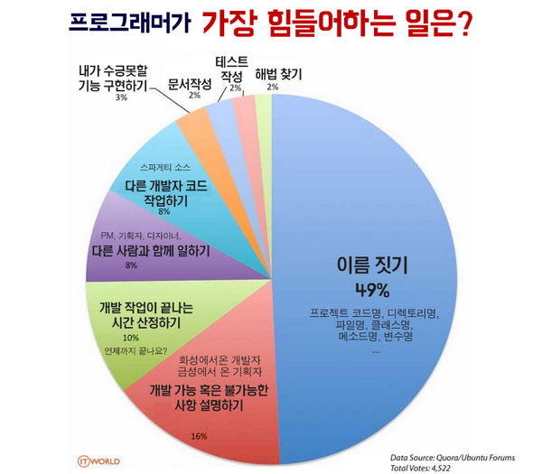

# Lecture2. Variable, Primitive Data Types, Operators
## 0. 복습과 디버깅
0. 프로그래밍 개념
    - 프로그래밍은 컴퓨터가 하는 일을 시키는 것이다
    - 컴퓨터는 데이터를 저장하고 연산하는 일을 잘한다
    - 왜 해야하는지 생각해보기 

1. 파이썬 프로그래밍
    - 개발환경 세팅: Python(interpreter), VS code(text editor) 설치
    - 인터프리터 실행
    - 소스코드 실행 (<kbd>Ctrl</kbd>+<kbd>N</kbd> &rarr; <kbd>Ctrl</kbd>+<kbd>S</kbd> &rarr; 콘솔 실행(<kbd>Ctrl</kbd>+<kbd>\`</kbd> / `cmd`)

2. 표준 입출력
    - `print()`
    - `input()`
    - `input()`과 `input("어떤 말")`의 차이
    - 표준 입출력에서 '표준'의 의미: 키보드와 모니터

* 디버깅
    - `cat`(linux) &rarr; `type`(windows)
    - pylint 설치하기


## 1. 변수
#### Why and What?
- Why? 데이터 처리할건데, 데이터를 계속해서 사용할 필요가 있다 &rarr; 데이터를 저장해두고 싶다
- What? 변수: 데이터에 이름을 붙인 것. 데이터를 담아두는 봉투 / 그릇

#### How?
1. 변수 선언: `variable_name = value` &rarr; 봉투에 값 넣어두고 이름 붙이기
2. 변수 사용: `' = '` 의 왼쪽이 아닌 곳에서 `variable_name` &rarr; 봉투 이름으로 봉투 찾아서 들어있는 값 확인
3. 변수명 정하기
    - 알파벳, 한글, 숫자, _
    - 대소문자 구분, `keywords` 안됨
    - 의미 있는 이름 붙이기. **중요함**. `cnt = 123`과 `t = 123'`의 차이
        - > 인용: 코드는 사람이 읽기 위해 쓰여진 것, 컴퓨터가 우연히 읽을수 있다면 좋은것
        - 프로그래머가 힘들어하는 일
        

### 코딩
```python
# variable.py: 변수 선언과 활용

# 숫자 변수
num = 910618
print(num)

# 숫자 변수 연산
numA = 54
numB = 21
print(numA + numB)
print(numA * numB + numA / numB)

# 문자 변수
greeting = "안녕하세요"
print(greeting)
print("greeting")   # 차이를 알겠나요?

# 변수명은 한글도 된다. 변수명에 띄어쓰기는 하면 안됨)
한글도된다 = "Hello guys, how are you?"
print(한글도된다)

# 변수 값들을 연산해서 새로운 변수에 넣기. 저 위에서 선언한 변수 활용
numC = numA - numB
print(numC)

# 물론 자기 자신도 사용할 수 있음
numC = numC * numC
print(numC)
```
```python
# hello_variable.py : 변수와 input, print 합쳐서 활용

# 인사는 내가 먼저
print("=== 인사 프로그램 ver 1.0 ===")
print("안녕하세요. 당신을 소개해주세요")

# 입력 받기
name = input("이름이 뭐예요: ")
age = input("나이는요?: ")

# 데이터 저장한 변수를 활용해서 출력하기
print(name)
print("님 안녕하세요. 반갑습니다.")
print(name)
print("님은")
print(age)
print("살이군요. 건강하세요. 파이팅!")
```

---
## 2. 자료형
#### Why and What?
- Why? 다루려는 자료가 어떤 종류인지 파악하기 위해, 알맞게 다루기 위해
    ex) 핸드폰과 망치 / 음식과 옷
- What? (실습)
    1. 수 자료형: `7`, `3.14`, `-243`, `0x1fa0`, `0o247`, `0b101101`, `1 + 4j`
    2. 문자열 자료형: `'작은 따옴표 문자열'`, `"큰 따옴표 문자열"`, `''`, `'''여러줄'''`, `"""여러줄"""`, `'\n\t'`
    3. 논리 자료형: `True`, `False`

#### How?
1. 자료형 결정: 자동(dynamic type check)으로. `str = "문자열"`
    - 비교: C에서는 `char[] str = "문자열";` Java에서는 `String str = "문자열";`
2. 자료형 확인: `type( variable )`, `type( "data" )`, `type( 145.73 )`, ...

### 코딩
```python
# type_num.py
# 수(정수, 실수) 자료형 연습

# 수 데이터
20190411
3.1415926535897
-273

# 이름 붙이기 = 변수로 가리키기
date_int = 20190411
pi_float = 3.14
absolute_zero_celcius = -273
remaining_days = -273

# 자료형 확인
type(date_int)
type(pi_float)
```
```python
# type_str.py
# 문자열 자료형 연습

# 문자열 데이터
'이것은 문자열'
"이것도 문자열"
type('이것은 문자열')

# 이름 붙이기. 변수로 가리키기
name = 'Yongjae'
type(name)

# 홑따옴표, 쌍따옴표
single_quote = 'Single quotation mark. "double quote mark" can be used'
print(single_quote)
double_quote = "쌍따옴표 문자열. 문자열 안에 '작은 따옴표'"
print(double_quote)

# 여러줄
multi_line_str = '''this is multi line str
second line
third line
'''
print(multi_line_str)
```
```python
# type_var_exercise.py
# 자료형과 변수 같이 연습하기

# 자신과 관련된 정보를 적어보자
name = 'coalee'
nickname = "머큰"

age = 23
birth_year = 1997
birth_month = 4
birth_date = 21

major = '컴퓨터공학'
hometown = '신하리'
bucket_list1 = '수만명이 사용하는 서비스 개발'
bucket_list2 = '돈 "많이" 벌어서 잘 사용하기'
favorite_food = '김치 닭도리탕'
# 더해서 좋아하는 무언가 두개 적어보기. ex) 좋아하는 영화, 색, 계절, 숫자, 가수 등등

```

---
## 3. 연산자
#### Why and What?
- Why? 주어진 자료를 조작하기. 계산을 통해 원하는 값을 얻기. 
- What?
    - 자료 &rarr; 연산 &rarr; 결과 &rarr; 저장 / 활용
    - 연산 중 기본이 되는 연산자

#### How?
1. 수 연산자: `+`, `-`, `*`, `/`, `%`, `//`, `**`

2. 문자열 연산자: `+`, `*`

3. 비교 연산자: `>`, `>=`, `<`, `<=`, `==`, `!=`, `is`

4. 논리 연산자: `and`, `or`, `not`, `&&`, `||`, `!`

*  자료형 변환: `int('123')`, `str(545)`


### 코딩
```python
# op_arithmetic.py
# 수 연산자 연습

# 값으로 바로 연산
print(190 + 411)
print(190 - 411)
print(190 * 411)
print(411 / 190)
print(411 // 190)
print(411 % 190)

# 변수 활용 연산
numA = 190
numB = 411
print(numA + numB)
print(numA - numB)
print(numA * numB)
print(numB / numA)
print(numB // numA)
print(numB % numA)

# 변수에 들어간 값 바꾸기
numA = ' '
numB = ' '

```
```python
# op_string.py
# 문자열 연산자 연습

# 값으로 바로 연산
print("안녕하세요 저는" + '하랑' + "입니다")
print('당신이 가장 좋아하는' + "음식" + "은 무엇인가요?")
print("안녕" * 4)
print("안녕\n" * 5)

# 변수 활용 연산
name = "하랑"
category = "음식"
msg = "잘가"

print("안녕 내 이름은 " + name + "라고 해")
print("제일 좋아하는 " + category + "가 뭐니?")
print(msg * 3)
print(msg + "\n" * 3)
print((msg + "\n") * 3)

# 변수에 들어간 값 바꿔보기

```
```python
# op_cast.py
# 형 변환 연습

year = 2019
year_str = "2019"

print(year)
print(year_str)

print(type(year))
print(type(year_str))

print(year + "년")    # error
print(str(year) + "년") 

print(year_str * 10)
print(int(year_str) * 10)
```

### 실습: 지금까지 배운 것으로 연습해보기
```python
# exercise2_calc.py
# 계산기: 사칙연산 결과 나타내기

# 인트로 
print("--- 하랑 계산기 ver 1.0 ---")
print("두 정수를 입력하면 사칙연산 결과를 내보내겠소.")

# 입력 받기
strA = input("첫번째 수는 무엇이오: ")
strB = input("두번째 수를 알려주시오: ")
# 입력으로부터 정수로 변환하기. 매번 해도 되지만 이렇게 하는게 편할 것 같다.
numA = int(strA)
numB = int(strB)

# 출력하기. 문자열 덧셈 연산과 정수 사칙연산 
print(strA + " + " + strB + " = " + numA + numB)
print(strA + " - " + strB + " = " + numA - numB)
print(strA + " X " + strB + " = " + numA * numB)
print(strA + " / " + strB + " = " + numA / numB)

print("--- 계산 완료 ---")
```
```python
# exercise2_hello.py
# 인사 상호작용: 사용자 정보 입력 받고 맞춰서 출력하기

# 인트로 
print("--- 인사 맞이 프로그램 ---")
print("안녕하세요 :)")
print("당신에 대해서 알려주세요")

# 기본 정보 입력 
name = input("이름: ")
hometown = input("고향: ")

age = int(input("몇 살인가요? "))
birth_year = int(input("태어난 연도를 알려주세요: "))
birth_month = int(input("태어난 월과: "))
birth_date = int(input("태어난 날짜도요: "))

# 기본 정보 가지고 출력하기 
print(hometown + "에서 태어난 " + name + "님 반갑습니다!")
print("기본적인 정보를 입력 받았습니다. 추가 정보를 입력해주세요.")

# 부가 정보 입력
major = input("전공: ")
bucket_list1 = input("버킷 리스트 첫번째: ")
bucket_list2 = input("버킷 리스트 두번째: ")
favorite_food = input("좋아하는 음식은? ")

# 부가 정보 가지고 출력하기
print(major + "전공을 가진 " + name + "님의 버킷리스트: ")
print("1. " + bucket_list1)
print("2. " + bucket_list2)

# 인사
print("버킷 리스트 꼭 달성하길! 안녕히 가세요 :)")
```