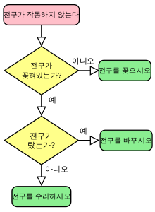
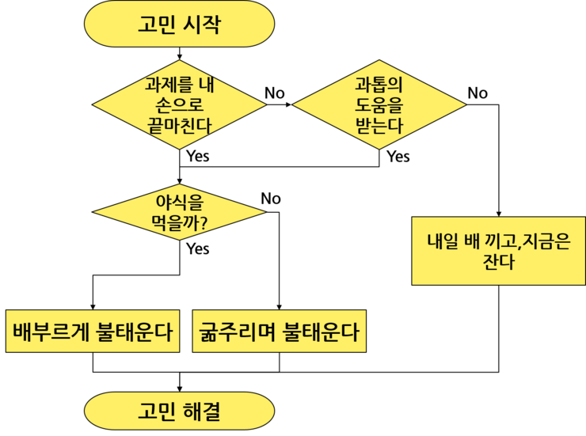

# Lecture3. Logical Data Types, Logical Operators, Conditional Statement
## 0. 복습
0. 프로그래밍 개념
    - 프로그래밍은 컴퓨터가 하는 일을 시키는 것이다
    - 컴퓨터는 데이터를 저장하고 연산하는 일을 잘한다
    - 순서도. 

    
    
    - 프로그래밍과 코딩.
    - 예시) 요리 레시피. 한글 레시피, 영어 레시피, 기호 레시피
    - 배우는 방식: Why & What 은 프로그래밍, How는 파이썬 코딩

1. 파이썬 프로그래밍
    - 개발환경 세팅: Python(interpreter), VS code(text editor) 설치
    - 인터프리터 실행
    - 소스코드 실행 (<kbd>Ctrl</kbd>+<kbd>N</kbd> &rarr; <kbd>Ctrl</kbd>+<kbd>S</kbd> &rarr; 콘솔 실행(<kbd>Ctrl</kbd>+<kbd>\`</kbd> / `cmd`)

2. 표준 입출력
    - `print()` 함수
    - `input()` 함수
    - `input()`과 `input("어떤 말")`의 차이
    - 표준 입출력에서 '표준'의 의미: 키보드와 모니터

3. 변수
    - 데이터를 저장하고 계속 활용하기 위해서 봉투에 담는 것
    - 변수 선언: `=` 왼쪽에 변수 이름, 오른쪽에 값
    - 변수 사용: `=` 왼쪽이 아닌 곳에서 변수 이름

4. 기본 자료형: 정수, 실수, 문자열
    - 다루려는 자료를 확인하고 알맞게 다루기 위해
    - 요리 재료의 구분과 비슷
    - 파이썬에서 자료형 결정은 자동(dynamic type check, 동적)으로 됨 
    - 자료형 확인은 `type()` 함수 활용 

5. 기본 연산자: 수 연산, 문자열 연산
    - 연산: 주어진 자료를 조작, 계산을 통해 원하는 값 얻기
    - 자료 &rarr; 연산 &rarr; 결과 &rarr; 저장 / 활용
    - 연산 중 기본이 되는 연산자

- 순서도에 있는 그 마름모 모양을 배우는 것

## 1. 논리값, 자료형
#### Why and What?
- Why? 
    - 논리적인 의미 표현. 예) 조건, 어떤 검증한 결과. 
    - 우리 생활 중, 사고 속에도 있음. 
- What? 참 / 거짓. Boolean

#### How?
1. 참: `True`
2. 거짓: `False`

```python
# type_boolean.py

# 논리값
True    # not true
False   # not false

# 변수에 담기
yongIsSmart = True
isPythonBoring = False

type(yongIsSmart)
```
```python
# etc_naming.py
import keyword

print(keyword.kwlist)
'''
['False', 'None', 'True', 'and', 'as', 'assert', 'break', 'class',
'continue', 'def', 'del', 'elif', 'else', 'except', 'finally', 'for',
'from', 'global', 'if', 'import', 'in', 'is', 'lambda', 'nonlocal',
'not', 'or', 'pass', 'raise', 'return', 'try', 'while', 'with', 'yield']
'''
global = "we are the world"     # SyntaxError

# print, input은?
print = "프린트하자"
input = "입력 값입니다"
```

## 2. 비교(관계) 연산자, 논리 연산자
#### Why and What?
- Why? 논리값 다루기 = 논리값 판단 + 논리값의 연산
- What?
    - 판단: 비교 연산자 (값과 값의 비교 &rarr; 논리값)
    - 연산: 논리 연산자 (논리값과 논리값의 연산)

#### How?
1. 비교 연산자
    - `>` , `>=` , `<` , `<=` , `==` , `!=`
2. 논리 연산자
    - `A and B`: 양쪽 다 True면 True  ( `A && B` )
    - `A or B`: 한 쪽이라도 True면 True ( `A || B` )
    - `not A`: A가 True 면 False, A가 False면 True ( `!A` )

    | `A` | `B` | `A and B` | `A or B` | `not A` | `not (A and B)` |
    |:-:|:-:|:-:|:-:|:-:|:-:|
    |`False`|`False`|`False`|`False`|`True` |`True` |
    |`False`|`True` |`False`|`True` |`True` |`True` |
    |`True` |`False`|`False`|`True` |`False`|`True` |
    |`True` |`True` |`True` |`True` |`False`|`False`|

### 코딩
```python
# op_comparison.py

print(1 > 5)
print("2 <= 3.57: " + str(2 <= 3.65))  # Wrong

# 변수 활용하기
A = 54
B = 29
print(str(A) + " >= " + str(B) + ": " + str(A <= B))

# 위와 같은 형식으로 C와 D가 같은지 다른지를 확인하는 코드를 작성해보자
C = 149 # 변수 선언
D = 53  # 변수 선언
print(str(A) + " == " + str(C) + ": " + str(A == B))  # 같은지 확인
print(str(A) + " != " + str(C) + ": " + str(A != B))  # 다른지 확인


# 문자열 비교
print("harang" < "programming")
print("123" < "456")
print("123" < 456)      # TypeError

# 타입 확인
type(A) == str
type(A >= C) == int
```
```python
# op_logical.py

numA = 38
numB = -9
numC = 50

print(numA < numB)
print(numB < numC)
print(numA < numB and numB < numC)      # and 활용
print(numA < numB or numB < numC)       # or 활용
print(not (numA < numB))                # not 활용
print(not (numA < numB) and numB < numC)    # 섞어서 활용

# 변수를 활용한 형식으로 바꾸면?
boolA = numA < numB
boolB = numB < numC
print(boolA)
print(boolB)
print(boolA and boolB)
print(boolA or boolB)
print(not boolA)
print(not boolA and boolB)

```

## 3. 조건문 
#### Why and What?
- Why? 프로그램의 실행, 조건에 따라 다르게 실행하고 싶다
- What? 조건 검사, 참이면 진행할 내용, 거짓이면 진행할 내용

#### How?

1. 기본 형식
    ```python
    if [condition]:
        [statements]
2. `[condition]`: 논리값(`True`, `False`)를 산출하는 모든 것(식, 변수, 함수, ...)
3. 한 탭(스페이스 네번) **들여쓰기** 이후 내용 적기
4. 조건이 만족하지 않을 때: `else`, `elif`
    ```python
    if [condition]:
        [statements]
    else:
        [statements]
    ```
    ```python
    if [condition]:
        [statements]
    elif [another condition]:
        [statements]
    else:
        [statements]
    ```

#### ※ Block 개념
- 프로그램 소스에서 하나의 처리 단위. 변수의 범위가 정해진다.
- python 에서는 탭(스페이스 4회)으로 구분, 다른 언어(C, Java)는 `{ }` 중괄호.

### 코딩
```python
# cond_if_else.py
if 5 < 10:
    print("5는 10보다 작습니다")

# 변수의 음수 여부를 판단해보자
numA = 7
if numA < 0: 
    print(str(numA) + "는 음수입니다.")

# 입력받은 수를 검사해보자
inNum = input("검사할 수를 입력해주세요: ")
if inNum % 3 == 0:
    print(str(inNum) + "는 __입니다.")  # 뭐라고 쓰면 될까요
else:
    print(str(inNum) + "는 __ 아닙니다.")

# 문자열 비교
word = "apple"
if (word == "apple"):
    print("사과입니다")
else:
    print("사과 아닙니다")

```
```python
# cond_elif.py

# elif 활용. 검사를 자세하게 해보자
age = input("나이를 입력해주세요")

if age >= 10 and age < 20:
    print("10대입니다.")
elif age >= 20 and age < 30:
    print("20대입니다.")
elif age >= 30 and age < 40:
    print("30대입니다.")
else:
    print("청춘입니다")     
print("검사 끝")

# 혹시 오류가 있을까?
# 좀더 간결하게 쓰는 방법은? 
```

- 지난 Day2에 있었던 exercise들을 오늘 배운 내용을 활용해 발전시켜보자
```python
# exercise2_calc.py
# 계산기: 사칙연산 결과 나타내기

# 인트로 
print("--- 하랑 계산기 ver 1.3 ---")
print("두 정수를 입력하면 사칙연산 결과를 내보내겠소.")

# 입력 받기
strA = input("첫번째 수는 무엇이오: ")
strB = input("두번째 수를 알려주시오: ")
# 입력으로부터 정수로 변환하기. 매번 해도 되지만 이렇게 하는게 편할 것 같다.
numA = int(strA)
numB = int(strB)

# 출력하기. 문자열 덧셈 연산과 정수 사칙연산 
print(strA + " + " + strB + " = " + numA + numB)
print(strA + " - " + strB + " = " + numA - numB)
print(strA + " X " + strB + " = " + numA * numB)
print(strA + " / " + strB + " = " + numA / numB)

print("--- 계산 완료 ---")
```

```python
# exercise2_hello.py
# 인사 상호작용: 사용자 정보 입력 받고 맞춰서 출력하기

# 인트로 
print("--- 인사 맞이 프로그램 Ver 1.3 ---")
print("안녕하세요 :)")
print("당신에 대해서 알려주세요")

# 기본 정보 입력 
name = input("이름: ")
hometown = input("고향: ")

age = int(input("몇 살인가요? "))
birth_year = int(input("태어난 연도를 알려주세요: "))
birth_month = int(input("태어난 월과: "))
birth_date = int(input("태어난 날짜도요: "))

# 기본 정보 가지고 출력하기 
print(hometown + "에서 태어난 " + name + "님 반갑습니다!")
print("기본적인 정보를 입력 받았습니다. 추가 정보를 입력해주세요.")

# 부가 정보 입력
major = input("전공: ")
bucket_list1 = input("버킷 리스트 첫번째: ")
bucket_list2 = input("버킷 리스트 두번째: ")
favorite_food = input("좋아하는 음식은? ")

# 부가 정보 가지고 출력하기
print(major + "전공을 가진 " + name + "님의 버킷리스트: ")
print("1. " + bucket_list1)
print("2. " + bucket_list2)

# 인사
print("버킷 리스트 꼭 달성하길! 안녕히 가세요 :)")
```
